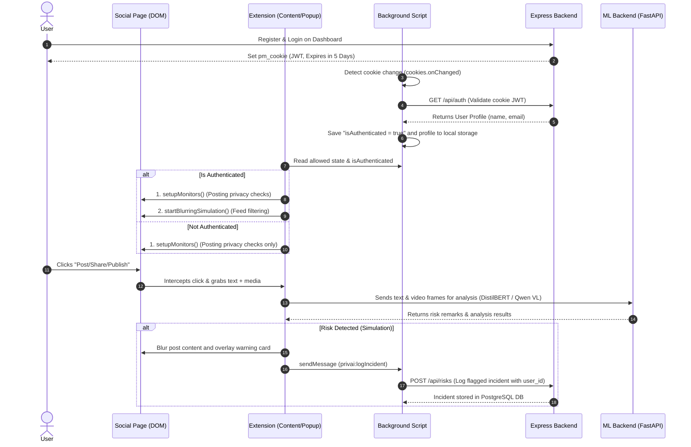
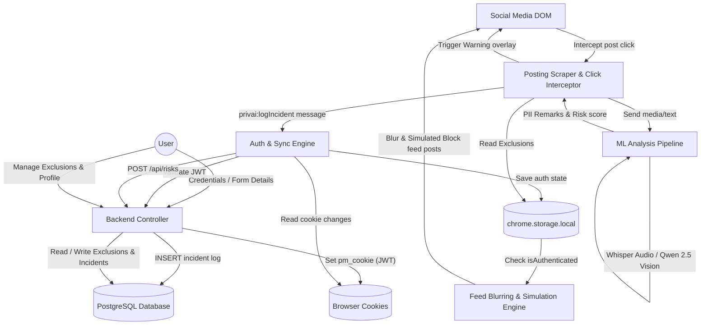
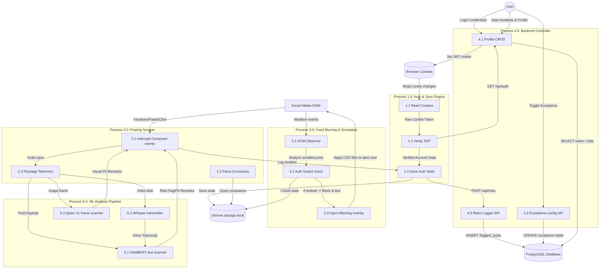
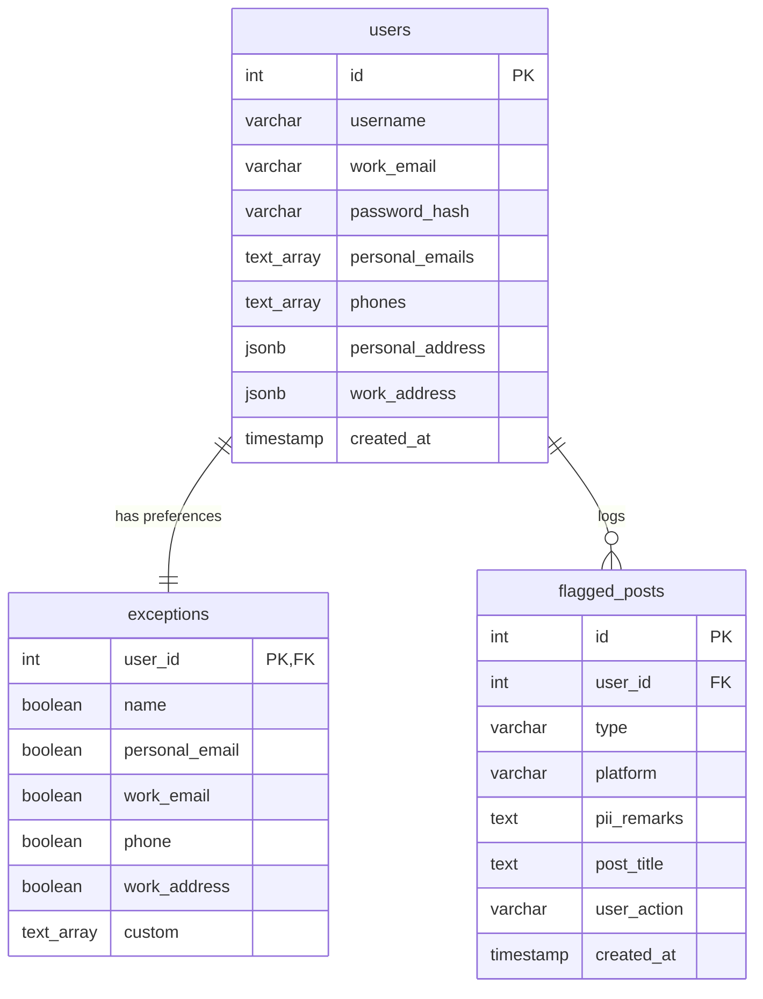

# privAI Project Architecture & User Request Flow

This document details the architecture, request flow, and data routing of the **privAI** privacy monitor assistant, including details on image/video risk analysis powered by Qwen 2.5 Vision.

---

## 1. Project Overview

`privAI` is a client-side privacy assistant designed to protect users in two ways:
1. **Posting Leak Prevention**: Intercepts and screens content (text and media) that the user is about to publish to prevent accidental data leaks.
2. **Feed Filtering Protection**: Screens content appearing on the user's feed, applying visual blur overlays to high-risk posts so that the user does not have to consume harmful or sensitive content.

The system consists of four main sub-systems:
* **WXT Browser Extension (`extension/`)**: Injects content scripts into platforms (LinkedIn, Facebook, Instagram) to monitor post creation and feeds.
* **React Frontend Dashboard (`frontend/`)**: Renders metrics, risk charts, and configures user privacy settings.
* **Node.js Express Backend (`backend/`)**: Manages the PostgreSQL database and session authentication using JWT cookies.
* **ML Backend (`ml-backend/`)**: Hosts the deep learning models for classification:
  * **Fine-Tuned DistilBERT**: Checks and flags privacy risks inside text snippets.
  * **Qwen 2.5 VL (Vision-Language)**: Extracts visual PII and computes risk factors from images and video frames.
  * **Faster-Whisper**: Transcribes video audio tracks.

### Avoiding Re-Analysis (Caching)
To ensure optimal performance and low latency, flagged posts and their analysis details are permanently saved in the PostgreSQL database. On subsequent loads, the system refers to these cached results to avoid re-analyzing the same posts.

---

## 2. User Request Flow

The operational flow spans user setup, active monitoring, and analytical reporting:

---

## 3. Data Flow Diagram (DFD) Level 0

### Data Flow Diagram Schematic (DFD Level 0 - B/W)

---

## 4. Data Flow Diagram (DFD) Level 1

### Process Flow Schematic (DFD Level 1)

---

## 5. Entity-Relationship (ER) Diagram

### Entity-Relationship Diagram Schematic (ERD - B/W)

---

## 6. Black & White Architectural Diagrams

The database schemas, tech stacks, component architecture, and overall request flows are visually represented below in print-quality black and white schematics:

### 1. High-Level Architecture

### 2. Tech Stack Block Diagram

### 3. Frontend, Backend & Database Architecture

### 4. Overall User POV Request Flow

---

## 7. Model Verification & Pipeline

### Text Screening (DistilBERT)
* Draft captions, texts, and comments are passed to a fine-tuned **DistilBERT** classification model.
* It checks text content for sensitive keywords, security passcodes, project codenames, and private markers.

### Media Scanning (Qwen 2.5 VL & Whisper)
* **Audio Track**: Video audio is extracted and transcribed via **Faster-Whisper**.
* **Visual Frame Capture**: Images and video keyframes are sent to **Qwen 2.5 VL (Vision-Language)**.
* **PII Extraction**: The vision model extracts text and visual tags to flag badges, whiteboards, shipping labels, nameplates, and screens in the background showing sensitive documents.
* **Risk Severity**: A risk level is calculated dynamically and cached in PostgreSQL (`flagged_posts`) to avoid duplicate scans.
