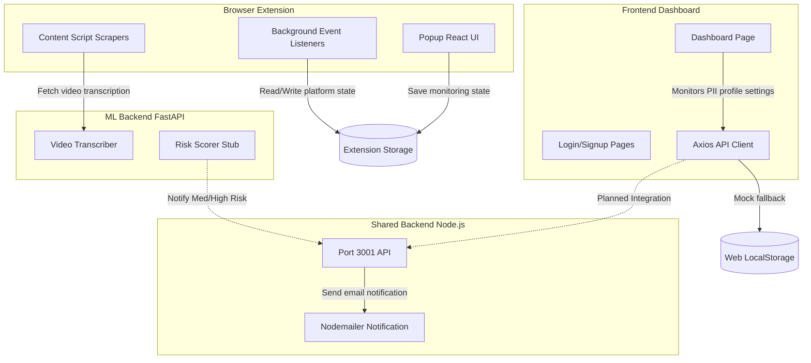
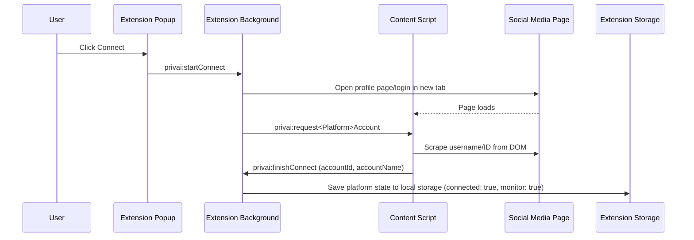
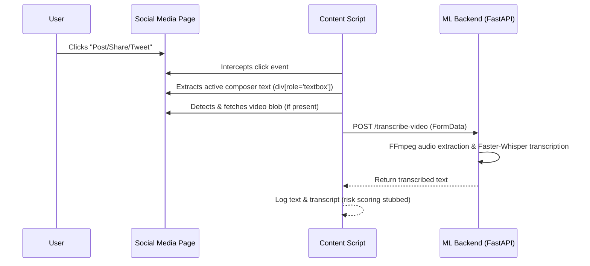

# privAI

Saving you from sharing private info online.

`privAI` is a browser-extension-based privacy assistant that monitors what a user is about to post on supported social platforms (LinkedIn, Facebook, Instagram, Twitter/X) and runs client-side checks (with local ML assistance) to flag sensitive information before it is published.

---

## 🏗️ Architecture & Interaction Flow

The project is structured into three main sub-systems:
1. **Browser Extension (`extension/`)**: Watches composer fields in real time, intercepts submission clicks, scrapes video files for transcription, and manages the user's active social platform links.
2. **Web Frontend (`frontend/`)**: A React dashboard where users can define their private profiles (work email, personal emails, phone numbers) and review monthly risk timeline stats.
3. **ML Backend (`ml-backend/`)**: A FastAPI Python service that hosts Faster-Whisper to transcribe video audio and runs a placeholder risk-scoring classifier.

### High-Level Component Topology


### Flow 1: Platform Connection Sequence
When a user clicks "Connect" on a social platform inside the extension popup, `privAI` automates account correlation:


### Flow 2: Post & Video Monitoring Sequence
When monitoring is active, the content script intercepts post publications:


---

## 📁 Repository Walkthrough

```
privAI/
├── extension/          # WXT Browser Extension (React + Tailwind)
├── frontend/           # React Web Application (Vite + React Router)
├── ml-backend/         # Python FastAPI ML Services
└── backend/            # Planned Node.js API Backend (Empty Placeholder)
```

### 1. Browser Extension (`extension/`)
The extension utilizes the [WXT framework](https://wxt.dev/) with React and Tailwind CSS.

*   **`entrypoints/`**:
    *   [background.js](file:///d:/Projects/privAI/extension/entrypoints/background.js): Coordinates OAuth/Connect flows, listens for tab updates/removals, and saves platform settings to browser local storage.
    *   [content.js](file:///d:/Projects/privAI/extension/entrypoints/content.js): Injected into every page. Initializes DOM listeners and responds to background connection requests.
    *   `popup/`: The popup window container. Contains the main entrypoint and stylesheet for the popup panel.
*   **`components/content/`**:
    *   [account-helpers.js](file:///d:/Projects/privAI/extension/components/content/account-helpers.js): Extracts active social handles/IDs from URLs and DOM landmarks (LinkedIn profile pages, Facebook URLs, Instagram anchors).
    *   [data-scrapers.js](file:///d:/Projects/privAI/extension/components/content/data-scrapers.js): Scrapes text from elements containing `role="textbox"`. It also detects `<video>` tags, downloads the media stream, and POSTs it to the ML backend for audio transcription.
    *   [monitoring-helpers.js](file:///d:/Projects/privAI/extension/components/content/monitoring-helpers.js): Intercepts user click actions on buttons labeled "Post", "Share", "Tweet", "Reply", or "Send".
*   **`components/background/`**:
    *   `linkedin-events.js`, `facebook-events.js`, `instagram-events.js`: Implement the discrete state machines that open login pages, wait for successful authentication redirects, and message content scripts to capture identity metrics.
*   **`components/ui/`**:
    *   [Platforms.jsx](file:///d:/Projects/privAI/extension/components/ui/Platforms.jsx): Renders the toggle switches and action buttons for connecting and configuring active sites.
    *   [Theme.jsx](file:///d:/Projects/privAI/extension/components/ui/Theme.jsx): Implements theme switching with support for Light, Dark, Purple, and Teal colorways.
*   **`components/shared/`**:
    *   [constants.js](file:///d:/Projects/privAI/extension/components/shared/constants.js): Global settings, configurations, default object models, and chrome storage helpers.

---

### 2. Frontend Dashboard (`frontend/`)
A dashboard created with React, Vite, Tailwind CSS, and React Router. It functions as the administration panel for user profile specifications.

*   **`src/pages/`**:
    *   [LandingPage.jsx](file:///d:/Projects/privAI/frontend/src/pages/LandingPage.jsx): Marketing entry point explaining the privacy-protecting capabilities of `privAI`.
    *   [LoginPage.jsx](file:///d:/Projects/privAI/frontend/src/pages/LoginPage.jsx) & [SignupPage.jsx](file:///d:/Projects/privAI/frontend/src/pages/SignupPage.jsx): Registration forms.
    *   [DashboardPage.jsx](file:///d:/Projects/privAI/frontend/src/pages/DashboardPage.jsx): The main interactive interface. It renders:
        *   **PII & Monitoring Profiles**: View and edit fields (e.g., Username, Work Email, Personal Email Lists, Phone Numbers) that the extension monitors.
        *   **Risk Metric Widgets**: Cards representing "Total Incidents", "Monitored Emails", and "Monitored Phone Numbers".
        *   **Interactive Bar Chart**: Visualizes monthly exposure incidents split by PII categories (Email, Phone, Address).
*   **`src/api/auth.js`**:
    *   Simulates database communication via `localStorage` fallbacks (mocking `getUserProfile`, `updateUserProfile`, `getRiskData`). These functions are ready to be wired up to actual backend endpoints.

---

### 3. ML Backend (`ml-backend/`)
A Python service using FastAPI to run audio extraction and speech-to-text models.

*   **`main_copy.py`**:
    *   `POST /transcribe-video`: Receives an MP4 upload, runs `ffmpeg` asynchronously to strip the video and output a `16kHz` mono `.wav` file, and feeds the wav to `Faster-Whisper` (small model configuration).
    *   `POST /analyze-risk`: A placeholder endpoint designed to run PII / sensitivity categorization on scraped text.
    *   `notify_medium_high_risk()`: Communicates with an external Node notification server (`http://localhost:3001`) whenever medium or high-risk posts are intercepted.

---

## 🛠️ Local Development & Setup

### 1) Browser Extension
```bash
cd extension
npm install
npm run dev          # Launches WXT dev server (default is Chrome)
npm run dev:firefox  # Launches WXT dev server in Firefox
```
*Load the output extension files under the `.output` directory into your browser's Developer Extensions panel.*

### 2) Web Frontend Dashboard
```bash
cd frontend
npm install
npm run dev          # Spins up Vite local dev environment (typically http://localhost:5173)
```

### 3) ML Backend
Ensure you have `ffmpeg` installed and available in your system's environment `PATH` variable.
```bash
cd ml-backend
# Set up a python virtual environment
python -m venv ml-venv
ml-venv\Scripts\activate   # On Windows
source ml-venv/bin/activate # On Unix/macOS

pip install -r requirements.txt
uvicorn main_copy:app --reload --port 8000
```
*Note: Faster-Whisper is configured by default for CUDA execution (`device="cuda"`). Update `main_copy.py` (line 20) to `device="cpu"` if running on non-GPU instances.*

---

## ⚠️ Current Implementation Gaps & Next Steps
- **Model Integration**: The `/analyze-risk` endpoint currently returns a static stub. It needs to be replaced with a real fine-tuned risk model.
- **Unified Node Backend**: The `backend/` folder is empty. A shared database/API layer needs to be implemented to synchronize monitored profiles from the dashboard to the browser extension (rather than using independent storage).
- **DOM Robustness**: Social media websites frequently alter class names and DOM structures. Scrapers in `data-scrapers.js` require continuous monitoring and refinement.
