# privAI Extended Request Processing Workflow

This document details the extended end-to-end request processing workflows for the **privAI** privacy monitor assistant. It illustrates the interaction pathways between the User/DOM, Browser Extension components, React Dashboard, Node.js Express API, FastAPI Machine Learning server, and external Notification services.

---

## 1. System Architecture Components

| Component / Lifeline | Description | Tech Stack / Access |
| :--- | :--- | :--- |
| **User / Browser DOM** | Represents the active browser viewport on supported social media platforms (LinkedIn, Facebook, Instagram) where content script event interceptors run. | DOM Engine |
| **Extension Content Script** | Injected script that monitors DOM events, captures text/media composer states, and applies styling filters (blur/overlays). | WXT JavaScript Script |
| **Extension Background Script** | Long-running background worker script coordinating authentication cookie changes, local state updates, and incident log posts. | WXT Service Worker |
| **React Frontend (Dashboard)** | User dashboard interface providing metrics, logs list, and configuration toggles. | React (Port `5173`) |
| **Express Backend API** | Main application server managing session authentication, user configurations, exceptions list, and logged incidents. | Node.js / Express (Port `5000`) |
| **ML Backend (FastAPI)** | High-throughput AI engine running text, audio, and visual classification pipelines. | Python / FastAPI (Port `8000`) |
| **Notification Service** | Secondary alert server for dispatching SMTP notifications and updating external records on high-severity risks. | Node.js (Port `3001`) |
| **PostgreSQL Database** | Persistent relational database storing profiles, hashing secrets, exclusions, and incident log entries. | PostgreSQL DB |
| **chrome.storage.local** | Local client-side cache storing authentication states, exclusions, and active rules for low-latency retrieval. | Chrome Local Cache |

---

## 2. Request Processing Sequence Diagram

The diagram below details the chronological request-response cycles across all subsystems.

```mermaid
sequenceDiagram
    autonumber
    actor User as User
    participant Dom as Social Media DOM
    participant Content as Content Script
    participant BG as Background Script
    participant React as React Frontend (5173)
    participant Node as Express Backend (5000)
    participant ML as ML Backend (FastAPI 8000)
    participant Notif as Notification Server (3001)
    participant DB as PostgreSQL DB
    participant LocalStorage as chrome.storage.local

    %% 1. Authentication & State Sync Flow
    rect rgb(28, 33, 41)
        Note over User, LocalStorage: 1. Authentication & Cookie Sync Flow
        User->>React: Register / Login (Credentials)
        React->>Node: POST /api/auth/register OR /api/auth/login
        Node->>DB: Check/Insert User (Hash passwords via bcrypt)
        DB-->>Node: User Details
        Node->>DB: Insert default exceptions
        Node-->>React: Set pm_cookie (JWT) & Return user object
        React->>LocalStorage: Set isAuthenticated = true & user profile
        BG->>BG: Detect cookie change (cookies.onChanged)
        BG->>Node: GET /api/auth (with token)
        Node->>DB: Fetch user profile details
        DB-->>Node: User profile data
        Node-->>BG: Return User Profile (name, email, isAuthenticated: true)
        BG->>LocalStorage: Sync auth states & exceptions to local storage
    end

    %% 2. Content Script Init & setup
    rect rgb(38, 43, 51)
        Note over User, LocalStorage: 2. Extension Initialization & Platform Hooking Flow
        User->>Dom: Open LinkedIn / Facebook / Instagram
        Dom->>Content: Load content script
        Content->>LocalStorage: Query isAuthenticated & exclusions
        LocalStorage-->>Content: Return status & preferences
        alt Is Authenticated
            Content->>Dom: Invoke setupMonitors() (Keydown & Click trackers)
            Content->>Dom: Invoke startBlurringSimulation() (Feed DOM Observers)
        else Not Authenticated
            Content->>Dom: Invoke setupMonitors() (Posting checks only, default/unauthenticated exceptions)
        end
    end

    %% 3. Feed Blurring & Simulation Loop
    rect rgb(28, 33, 41)
        Note over User, LocalStorage: 3. Passive Feed Blurring & Threat Mitigation Loop
        loop Every DOM Mutation / Scroll
            Dom->>Content: MutationObserver detects new post element (.feed-shared-update-v2, etc.)
            Content->>LocalStorage: Read user profile exceptions & rules
            alt Post matches blocked identifiers (e.g. non-excepted phone, work_email, custom regex)
                Content->>Dom: Inject warning card overlay & apply CSS blur filter (.privai-overlay)
            end
        end
    end

    %% 4. Posting Leak Interception & Multimodal ML Analysis Flow
    rect rgb(38, 43, 51)
        Note over User, LocalStorage: 4. Posting Interception & Multimodal ML Analysis Flow
        User->>Dom: Write draft & click "Post / Share / Publish"
        Dom->>Content: Click Interceptor catches post event & blocks default action
        Content->>Dom: Extract textbox text (getActiveComposerText) & detect media (video / images)
        
        par Text-based PII scan
            Content->>ML: POST /analyze-risk (Text payload)
            ML->>ML: Run Fine-Tuned DistilBERT text classifier
            ML-->>Content: Return Risk Level ("none", "low", "medium", "high")
        and Video audio track transcription (if present)
            Content->>ML: Fetch video URL -> Blob -> POST /transcribe-video
            ML->>ML: ffmpeg extracts audio track (WAV)
            ML->>ML: Whisper model transcribes WAV audio track
            ML-->>Content: Return Transcribed Text
            Content->>ML: POST /analyze-risk (Transcribed Text)
            ML-->>Content: Return transcribed text risk level
        and Visual frame capture scanning (if present)
            Content->>ML: POST /analyze-frames (Keyframes array)
            ML->>ML: Run Qwen 2.5 Vision model to extract visual PII (badges, boards, shipping labels)
            ML-->>Content: Return Visual Risk Severity & remarks
        end
    end

    %% 5. Threat Mitigation, Notification, and Incident Logging
    rect rgb(28, 33, 41)
        Note over User, LocalStorage: 5. Incident Handling, Reporting, & Backend Sync
        alt Risk Detected (Medium or High Risk Level)
            Content->>Dom: Block post submission, show warning card, apply blur overlay
            Content->>BG: chrome.runtime.sendMessage (privai:logIncident)
            BG->>Node: POST /api/risks (Log flagged incident with user_id)
            Node->>DB: INSERT INTO flagged_posts
            DB-->>Node: Confirm record write
            par Trigger External Notification
                ML->>Notif: POST /sendmail-and-update-records
                Notif->>User: Send alert email via Nodemailer
            end
            Node-->>BG: Incident stored (returns log details)
            BG-->>Content: UI synced
        else No Risk Detected
            Content->>Dom: Allow post submission to complete (Normal event bubbles)
        end
    end

    %% 6. Dashboard Settings & Exceptions Sync Flow
    rect rgb(38, 43, 51)
        Note over User, LocalStorage: 6. Dashboard Exceptions Settings & Cache Sync Flow
        User->>React: Open Dashboard page
        React->>Node: GET /api/exceptions & GET /api/risks
        Node->>DB: Query user records (exceptions & flagged_posts)
        DB-->>Node: Raw config data & logs list
        Node-->>React: Send exceptions JSON and risks JSON
        User->>React: Update toggles (e.g. personal email exclusion) & save
        React->>Node: PUT /api/exceptions (Payload)
        Node->>DB: UPDATE exceptions table
        DB-->>Node: Updated exceptions config
        Node-->>React: Return confirmation
        Node->>BG: Broadcast settings update
        BG->>LocalStorage: Update cached exceptions in chrome.storage.local
    end
```

### Visual Request Processing Workflow (Black and White Schematic)

---

## 3. Tabular Request Flow Specification

This table maps each individual interaction step, outlining the source, target, API endpoints, payload configurations, and corresponding system states.

| Phase | Step | Source | Target | Interface / Method | Payload / Action Details |
| :--- | :--- | :--- | :--- | :--- | :--- |
| **1. Auth & Sync** | 1.1 | React Dashboard | Express Backend | `POST /api/auth/register` `POST /api/auth/login` | Passes `workIdentity`, `auth`, `monitoringContacts`, and `addresses` during registration; passes credentials during login. |
| | 1.2 | Express Backend | PostgreSQL DB | SQL Queries | Verifies password hash using `bcryptjs` and queries database fields. Inserts default exceptions on user creation. |
| | 1.3 | Express Backend | React Dashboard | Response | Returns user profile and sets JWT cookie `pm_cookie` (expires in 5 days). |
| | 1.4 | Extension Background | Express Backend | `GET /api/auth?cookie=...` | Invoked automatically when `chrome.cookies.onChanged` detects updates. Transmits cookie JWT to verify validity. |
| | 1.5 | Express Backend | Extension Background | Response | Returns authentication status: `isAuthenticated: true` and the fresh user profile structure. |
| | 1.6 | Extension Background | chrome.storage.local | Extension API | Writes `{ isAuthenticated: true, user: { name, email } }` to the local cache. |
| **2. Extension Init** | 2.1 | Social Media DOM | Content Script | Initialization | Triggered when matching platform domains (LinkedIn, Facebook, Instagram) are loaded. |
| | 2.2 | Content Script | chrome.storage.local | Local Read | Reads authentication states and exception preferences. |
| | 2.3 | Content Script | Social Media DOM | Hooking | Calls `setupMonitors()` to listen for composer DOM interactions and `startBlurringSimulation()` to initialize feed observers. |
| **3. Feed Blurring** | 3.1 | Social Media DOM | Content Script | `MutationObserver` | Scans target selectors (`div.feed-shared-update-v2`, `article`, `div[role='article']`) during scroll events. |
| | 3.2 | Content Script | chrome.storage.local | Rule matching | Checks parsed post text elements against local exceptions. If user is authenticated, filters out safe entities. |
| | 3.3 | Content Script | Social Media DOM | DOM Injection | Appends `.privai-post-wrapper` class, injects a warning alert overlay, and applies visual blur to block reading of flagged posts. |
| **4. Post Analysis** | 4.1 | Social Media DOM | Content Script | Click Interceptor | Intercepts click events on "Post", "Share", "Publish", or "Comment" buttons. Halts event bubbling to review content. |
| | 4.2 | Content Script | ML Backend (FastAPI) | `POST /analyze-risk` | Sends raw textbox text scraped via `getActiveComposerText()`. |
| | 4.3 | ML Backend (FastAPI) | ML Models | DistilBERT Pipeline | Evaluates risk levels ("none", "low", "medium", "high") based on PII occurrences. |
| | 4.4 | Content Script | Social Media DOM | Media Check | Detects `<video>` tag presence. Fetches video file source as a Blob. |
| | 4.5 | Content Script | ML Backend (FastAPI) | `POST /transcribe-video` | Uploads video files in multipart/form-data. |
| | 4.6 | ML Backend (FastAPI) | Local OS | `ffmpeg` Execution | Splits and formats video tracks to mono WAV audio at 16000Hz. |
| | 4.7 | ML Backend (FastAPI) | ML Models | Faster-Whisper | Generates transcription text and re-submits text to `/analyze-risk` checks. |
| | 4.8 | Content Script | ML Backend (FastAPI) | `POST /analyze-frames` | Submits extracted keyframes as base64 images. |
| | 4.9 | ML Backend (FastAPI) | ML Models | Qwen 2.5 Vision | Extracts visual text to flag whiteboards, shipping labels, computer screens, and ID badges. Returns risk score. |
| **5. Mitigation & Log** | 5.1 | Content Script | Social Media DOM | UI Overlay | If risk level is "medium" or "high", displays warning card overlay and keeps the publish action locked. |
| | 5.2 | Content Script | Extension Background | `chrome.runtime.sendMessage` | Transmits `privai:logIncident` details (platform, post type, remarks, text title, and user action). |
| | 5.3 | Extension Background | Express Backend | `POST /api/risks` | Authenticated request conveying the metadata packet for storage. |
| | 5.4 | Express Backend | PostgreSQL DB | SQL INSERT | Inserts a new record into `flagged_posts` mapping the incident to the user. |
| | 5.5 | ML Backend (FastAPI) | Notification Service | `POST /sendmail-and-update-records` | Invoked on medium/high risks to request immediate notification routing. |
| | 5.6 | Notification Service | SMTP Server | nodemailer | Dispatches an alert email warning the user's registered work address. |
| **6. Configuration** | 6.1 | React Dashboard | Express Backend | `GET /api/exceptions` `GET /api/risks` | Requests current settings parameters and incident history to populate graphs. |
| | 6.2 | Express Backend | PostgreSQL DB | SQL SELECT | Pulls data from `exceptions` and `flagged_posts` tables. |
| | 6.3 | React Dashboard | Express Backend | `PUT /api/exceptions` | Transmits updated toggles (e.g. exceptions for personal emails, custom keywords, etc.). |
| | 6.4 | Express Backend | PostgreSQL DB | SQL UPDATE | Commits updated configuration settings to the database. |
| | 6.5 | Extension Background | Express Backend | Synchronization | Synchronizes user changes back to `chrome.storage.local`. |

---

## 4. Key Workflows & State Triggers

### A. Authentication & Identity Sync (Cookie Sync Pattern)
Rather than requesting users to login twice (on the extension and on the dashboard), privAI employs a cookie synchronization system:
1. **Shared Domain Context**: The extension resides on the local browser and listens to domain changes via `chrome.cookies.onChanged`.
2. **Session Sync**: When a user registers or logs in on `http://localhost:5173`, the Express Backend writes a secure token to the `pm_cookie` cookie.
3. **Background Capture**: The Background Script intercepts this cookie immediately, sends it to `http://localhost:5000/api/auth` to confirm it is valid, and stores the user configuration parameters within `chrome.storage.local`.
4. **Offline Access**: By updating storage, the Content Script can immediately verify user states on social platforms without invoking network checks, resulting in near-zero layout shift.

### B. Intelligent Media Interception & Transcription
When scanning rich media drafts:
* **Dynamic Audio Extraction**: Video files are processed dynamically. If a video is drafted, the content script downloads it as a Blob, transmits it to `/transcribe-video`, and relies on `ffmpeg` + `Faster-Whisper` to analyze audio transcripts before the publication completes.
* **Keyframe Scanning**: The system sends video frames to Qwen 2.5 Vision to ensure background information (like whiteboard post-it notes or laptop screens) is checked before posting.

### C. Incident Logging and Alert Escapes
To protect against accidental publication, the content script traps clicks using event capture:
1. When a post action occurs, event propagation is immediately blocked.
2. The ML Backend analyses the content.
3. If risk levels are acceptable (`none` or `low`), event bubble processing is resumed, allowing normal publishing.
4. If risk levels are unacceptable (`medium` or `high`), the button click is cancelled, the incident is logged in PostgreSQL, the UI blurs, and the notification service triggers email alerts.
